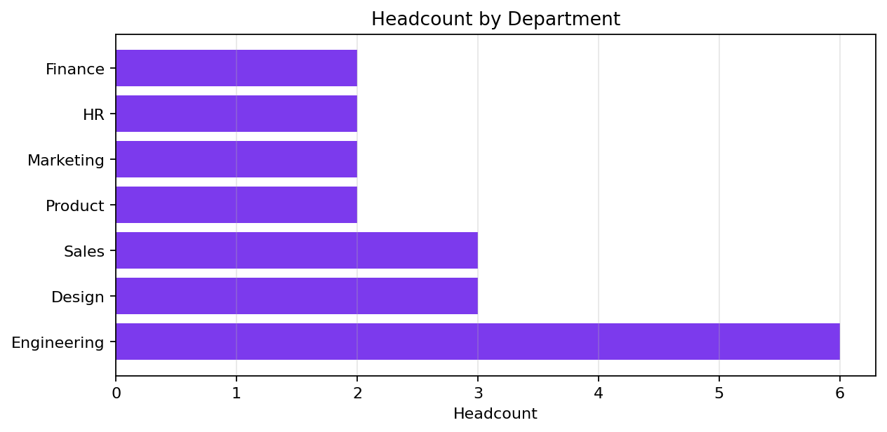
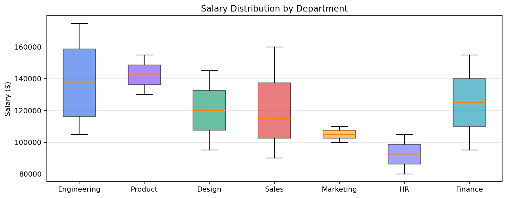
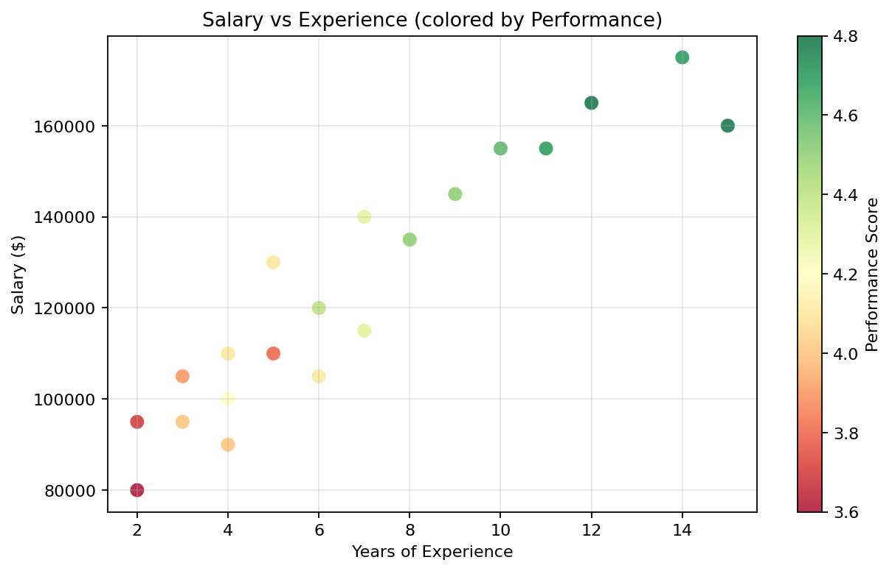

# Data Exploration Demo

An interactive-style exploration of a sample employee dataset, demonstrating
how notebookmd handles tabular data, summary statistics, and drill-down analysis.

## What This Demo Shows

- Dataset overview with shape and summary statistics
- Department analysis with tabbed team views
- Salary distribution box plots and comparison tables
- Performance ranking with scatter plot visualization
- Remote work analysis with crosstab tables
- City breakdown with aggregated metrics
- Collapsible deep-dives using expanders
- Multi-table CSV export

## Files

```
data-exploration/
├── README.md           # This file
├── data/
│   └── employees.csv   # 20 employees across 7 departments
├── run.py              # Exploration script
└── output/             # Generated report + chart assets
```

## Requirements

```bash
pip install "notebookmd[all]"   # pandas + matplotlib
```

## Run

```bash
cd examples/data-exploration
python run.py
```

## Sample Output

Generates `output/notebook.md` with tables, summary statistics, charts,
and exported CSVs in `output/assets/`.

---

<!-- BEGIN SAMPLE OUTPUT -->

# Employee Data Exploration

_Generated: 2026-02-21_

## Artifacts

- [dept_headcount.png](assets/dept_headcount.png)
- [salary_distribution.png](assets/salary_distribution.png)
- [perf_vs_salary.png](assets/perf_vs_salary.png)
- [employees_full.csv](assets/employees_full.csv)
- [department_summary.csv](assets/department_summary.csv)


---

## Dataset Overview

Exploring a sample dataset of **20 employees** across multiple departments.

#### Dataset Shape

| Key | Value |
| --- | --- |
| Rows | 20 |
| Columns | 10 |
| Departments | 7 |
| Cities | 4 |
| Date Range | 2018-05-12 to 2023-06-01 |

### Full Dataset

#### Employee Directory

| emp_id   | name          | department   | title             |   salary | hire_date           |   performance_score |   years_experience | city          | remote   |
|:---------|:--------------|:-------------|:------------------|---------:|:--------------------|--------------------:|-------------------:|:--------------|:---------|
| E001     | Alice Chen    | Engineering  | Senior Engineer   |   135000 | 2021-03-15 00:00:00 |                 4.5 |                  8 | San Francisco | yes      |
| E002     | Bob Martinez  | Engineering  | Staff Engineer    |   165000 | 2019-07-01 00:00:00 |                 4.8 |                 12 | San Francisco | no       |
| E003     | Charlie Kim   | Engineering  | Engineer          |   105000 | 2023-01-10 00:00:00 |                 3.9 |                  3 | Austin        | yes      |
| E004     | Diana Patel   | Engineering  | Senior Engineer   |   140000 | 2020-11-20 00:00:00 |                 4.3 |                  7 | New York      | yes      |
| E005     | Eve Johnson   | Engineering  | Tech Lead         |   175000 | 2018-05-12 00:00:00 |                 4.7 |                 14 | San Francisco | no       |
| E006     | Frank Liu     | Product      | Product Manager   |   130000 | 2022-02-28 00:00:00 |                 4.1 |                  5 | New York      | yes      |
| E007     | Grace Brown   | Product      | Senior PM         |   155000 | 2019-09-15 00:00:00 |                 4.6 |                 10 | Austin        | no       |
| E008     | Hank Wilson   | Design       | UI Designer       |    95000 | 2023-06-01 00:00:00 |                 3.7 |                  2 | Austin        | yes      |
| E009     | Irene Davis   | Design       | Senior Designer   |   120000 | 2021-01-20 00:00:00 |                 4.4 |                  6 | San Francisco | no       |
| E010     | Jack Taylor   | Design       | Design Lead       |   145000 | 2020-04-10 00:00:00 |                 4.5 |                  9 | New York      | no       |
| E011     | Karen White   | Sales        | Account Executive |    90000 | 2022-08-15 00:00:00 |                 4   |                  4 | Chicago       | yes      |
| E012     | Leo Adams     | Sales        | Senior AE         |   115000 | 2020-06-01 00:00:00 |                 4.3 |                  7 | Chicago       | no       |
| E013     | Maria Garcia  | Sales        | Sales Director    |   160000 | 2018-11-01 00:00:00 |                 4.8 |                 15 | New York      | no       |
| E014     | Nathan Clark  | Marketing    | Marketing Manager |   110000 | 2021-07-20 00:00:00 |                 3.8 |                  5 | Austin        | yes      |
| E015     | Olivia Moore  | Marketing    | Content Lead      |   100000 | 2022-03-10 00:00:00 |                 4.2 |                  4 | San Francisco | yes      |
| E016     | Pete Robinson | HR           | HR Manager        |   105000 | 2020-09-01 00:00:00 |                 4.1 |                  6 | Chicago       | no       |
| E017     | Quinn Harris  | HR           | Recruiter         |    80000 | 2023-04-15 00:00:00 |                 3.6 |                  2 | Austin        | yes      |
| E018     | Rachel Lee    | Finance      | Financial Analyst |    95000 | 2022-11-01 00:00:00 |                 4   |                  3 | New York      | yes      |
| E019     | Sam Walker    | Finance      | Finance Director  |   155000 | 2019-01-15 00:00:00 |                 4.7 |                 11 | New York      | no       |
| E020     | Tina Hall     | Engineering  | Engineer          |   110000 | 2022-06-01 00:00:00 |                 4.1 |                  4 | Chicago       | yes      |

_shape: 20 rows × 10 cols_

### Statistical Summary

#### Numeric Columns

- **Shape**: 20 rows × 3 cols
- **Columns**: salary, performance_score, years_experience

**Numeric stats (top 10):**

|                   |       mean |          std |     min |      max |
|:------------------|-----------:|-------------:|--------:|---------:|
| salary            | 124250     | 28016.7      | 80000   | 175000   |
| performance_score |      4.255 |     0.364872 |     3.6 |      4.8 |
| years_experience  |      6.85  |     3.8835   |     2   |     15   |

## Department Analysis

#### Department Summary

| department   |   headcount | avg_salary   |   avg_performance |   avg_experience |
|:-------------|------------:|:-------------|------------------:|-----------------:|
| Engineering  |           6 | $138,333     |               4.4 |              8   |
| Design       |           3 | $120,000     |               4.2 |              5.7 |
| Sales        |           3 | $121,667     |               4.4 |              8.7 |
| Finance      |           2 | $125,000     |               4.4 |              7   |
| HR           |           2 | $92,500      |               3.8 |              4   |
| Marketing    |           2 | $105,000     |               4   |              4.5 |
| Product      |           2 | $142,500     |               4.4 |              7.5 |

_shape: 7 rows × 5 cols_

[**Engineering** | **Product** | **Design** | **Sales** | **Other**]

#### Engineering

Headcount: **6** · Avg Salary: **$138,333** · Avg Score: **4.4**

#### Engineering Team

| name         | title           |   salary |   performance_score | city          |
|:-------------|:----------------|---------:|--------------------:|:--------------|
| Alice Chen   | Senior Engineer |   135000 |                 4.5 | San Francisco |
| Bob Martinez | Staff Engineer  |   165000 |                 4.8 | San Francisco |
| Charlie Kim  | Engineer        |   105000 |                 3.9 | Austin        |
| Diana Patel  | Senior Engineer |   140000 |                 4.3 | New York      |
| Eve Johnson  | Tech Lead       |   175000 |                 4.7 | San Francisco |
| Tina Hall    | Engineer        |   110000 |                 4.1 | Chicago       |

_shape: 6 rows × 5 cols_

---

#### Product

Headcount: **2** · Avg Salary: **$142,500** · Avg Score: **4.3**

#### Product Team

| name        | title           |   salary |   performance_score | city     |
|:------------|:----------------|---------:|--------------------:|:---------|
| Frank Liu   | Product Manager |   130000 |                 4.1 | New York |
| Grace Brown | Senior PM       |   155000 |                 4.6 | Austin   |

_shape: 2 rows × 5 cols_

---

#### Design

Headcount: **3** · Avg Salary: **$120,000** · Avg Score: **4.2**

#### Design Team

| name        | title           |   salary |   performance_score | city          |
|:------------|:----------------|---------:|--------------------:|:--------------|
| Hank Wilson | UI Designer     |    95000 |                 3.7 | Austin        |
| Irene Davis | Senior Designer |   120000 |                 4.4 | San Francisco |
| Jack Taylor | Design Lead     |   145000 |                 4.5 | New York      |

_shape: 3 rows × 5 cols_

---

#### Sales

Headcount: **3** · Avg Salary: **$121,667** · Avg Score: **4.4**

#### Sales Team

| name         | title             |   salary |   performance_score | city     |
|:-------------|:------------------|---------:|--------------------:|:---------|
| Karen White  | Account Executive |    90000 |                 4   | Chicago  |
| Leo Adams    | Senior AE         |   115000 |                 4.3 | Chicago  |
| Maria Garcia | Sales Director    |   160000 |                 4.8 | New York |

_shape: 3 rows × 5 cols_

---

#### Other

#### Other Departments

| name          | department   | title             |   salary |
|:--------------|:-------------|:------------------|---------:|
| Nathan Clark  | Marketing    | Marketing Manager |   110000 |
| Olivia Moore  | Marketing    | Content Lead      |   100000 |
| Pete Robinson | HR           | HR Manager        |   105000 |
| Quinn Harris  | HR           | Recruiter         |    80000 |
| Rachel Lee    | Finance      | Financial Analyst |    95000 |
| Sam Walker    | Finance      | Finance Director  |   155000 |

_shape: 6 rows × 4 cols_

---



*Employee distribution across departments*

## Salary Analysis

| **Median Salary** | **Mean Salary** | **Min** | **Max** |
| :---: | :---: | :---: | :---: |
| **$117,500** | **$124,250** | **$80,000** | **$175,000** |

#### Salary by Department

| Department   |   Mean |   Median |    Min |    Max |
|:-------------|-------:|---------:|-------:|-------:|
| Product      | 142500 |   142500 | 130000 | 155000 |
| Engineering  | 138333 |   137500 | 105000 | 175000 |
| Finance      | 125000 |   125000 |  95000 | 155000 |
| Sales        | 121667 |   115000 |  90000 | 160000 |
| Design       | 120000 |   120000 |  95000 | 145000 |
| Marketing    | 105000 |   105000 | 100000 | 110000 |
| HR           |  92500 |    92500 |  80000 | 105000 |

_shape: 7 rows × 5 cols_



*Box plot of salary ranges across departments*

## Performance Analysis

### Top 5 Performers

#### Top Performers

| name         | department   | title            |   performance_score |   salary |
|:-------------|:-------------|:-----------------|--------------------:|---------:|
| Bob Martinez | Engineering  | Staff Engineer   |                 4.8 |   165000 |
| Maria Garcia | Sales        | Sales Director   |                 4.8 |   160000 |
| Eve Johnson  | Engineering  | Tech Lead        |                 4.7 |   175000 |
| Sam Walker   | Finance      | Finance Director |                 4.7 |   155000 |
| Grace Brown  | Product      | Senior PM        |                 4.6 |   155000 |

_shape: 5 rows × 5 cols_

Bob Martinez: **4.8** (#1 of 20)

Maria Garcia: **4.8** (#2 of 20)

Eve Johnson: **4.7** (#3 of 20)

Sam Walker: **4.7** (#4 of 20)

Grace Brown: **4.6** (#5 of 20)

<details open>
<summary><strong>Performance vs Salary</strong></summary>

Examining the relationship between performance scores and compensation.



*Each dot represents an employee*

</details>

## Remote Work

Remote Workers: **11/20** (55% of workforce)

#### Average Salary by Work Mode

| Key | Value |
| --- | --- |
| Remote = no | $143,889 |
| Remote = yes | $108,182 |

#### Remote Distribution by Department

| department   |   no |   yes |
|:-------------|-----:|------:|
| Design       |    2 |     1 |
| Engineering  |    2 |     4 |
| Finance      |    1 |     1 |
| HR           |    1 |     1 |
| Marketing    |    0 |     2 |
| Product      |    1 |     1 |
| Sales        |    2 |     1 |

_shape: 7 rows × 3 cols_

## City Breakdown

#### Employees by City

| city          |   headcount | avg_salary   | remote_pct   |
|:--------------|------------:|:-------------|:-------------|
| New York      |           6 | $137,500     | 50%          |
| Austin        |           5 | $109,000     | 80%          |
| San Francisco |           5 | $139,000     | 40%          |
| Chicago       |           4 | $105,000     | 50%          |

_shape: 4 rows × 4 cols_

## Data Export

**Exported:** [Full employee dataset](assets/employees_full.csv)

**Exported:** [Department summary](assets/department_summary.csv)

> ✅ **Success:** Data exploration complete.

<!-- END SAMPLE OUTPUT -->
