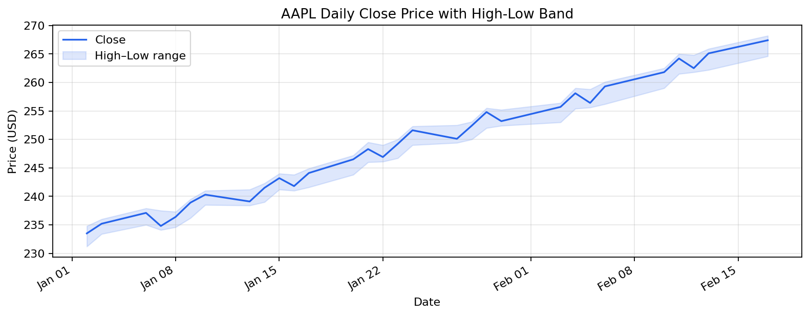
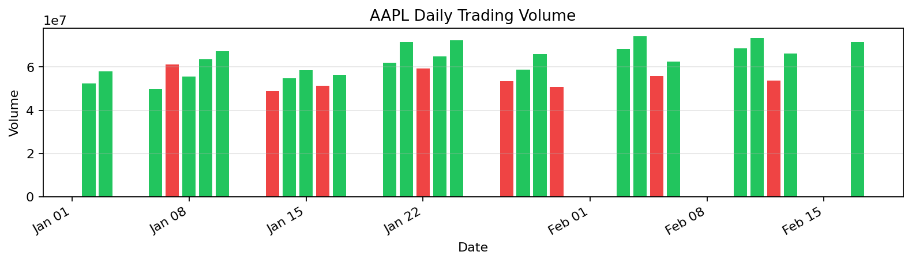

# AAPL Stock Analysis

_Generated: 2026-02-21 11:40:43_

## Artifacts

- [aapl_price_band.png](assets/aapl_price_band.png)
- [aapl_volume.png](assets/aapl_volume.png)
- [aapl_prices.csv](assets/aapl_prices.csv)
- [aapl_weekly.csv](assets/aapl_weekly.csv)

---

## Overview

This report analyzes **AAPL (Apple Inc.)** daily trading data for January–February 2026, covering price trends, volume patterns, and weekly aggregation.

#### Report Parameters

| Key | Value |
| --- | --- |
| Symbol | AAPL |
| Exchange | NASDAQ |
| Period | Jan 2 – Feb 17, 2026 |
| Frequency | Daily |

## Raw Data

#### Price data (first 10 rows)

| date                | symbol   |   close |   volume |   open |   high |   low |
|:--------------------|:---------|--------:|---------:|-------:|-------:|------:|
| 2026-01-02 00:00:00 | AAPL     |   233.5 | 52300000 |  232   |  234.8 | 231.2 |
| 2026-01-03 00:00:00 | AAPL     |   235.2 | 58100000 |  233.8 |  236   | 233.4 |
| 2026-01-06 00:00:00 | AAPL     |   237.1 | 49800000 |  235.5 |  237.9 | 235   |
| 2026-01-07 00:00:00 | AAPL     |   234.8 | 61200000 |  237.2 |  237.5 | 234.1 |
| 2026-01-08 00:00:00 | AAPL     |   236.4 | 55600000 |  235   |  237.3 | 234.6 |
| 2026-01-09 00:00:00 | AAPL     |   238.9 | 63500000 |  236.8 |  239.5 | 236.2 |
| 2026-01-10 00:00:00 | AAPL     |   240.3 | 67200000 |  239.1 |  241   | 238.5 |
| 2026-01-13 00:00:00 | AAPL     |   239.1 | 48900000 |  240.5 |  241.2 | 238.4 |
| 2026-01-14 00:00:00 | AAPL     |   241.5 | 54700000 |  239.4 |  242.3 | 239   |
| 2026-01-15 00:00:00 | AAPL     |   243.2 | 58400000 |  241.8 |  244   | 241.2 |

_shape: 10 rows × 7 cols_

_Showing 10 of 30 trading days_

## Summary Statistics

#### AAPL Trading Data Summary

- **Shape**: 30 rows × 4 cols
- **Columns**: close, volume, high, low

**Numeric stats (top 10):**

|        |          mean |          std |        min |        max |
|:-------|--------------:|-------------:|-----------:|-----------:|
| close  | 248.98        | 10.0337      | 233.5      | 267.4      |
| volume |   6.10167e+07 |  7.66852e+06 |   4.89e+07 |   7.42e+07 |
| high   | 250.173       |  9.98585     | 234.8      | 268.2      |
| low    | 246.963       |  9.80621     | 231.2      | 264.6      |

| **Latest Close** | **Total Return** | **Price Range** | **Avg Volume** |
| :---: | :---: | :---: | :---: |
| **$267.40** | **+14.5%** | **$33.90** | **61,016,667** |
| — | ▲ +14.5% | — | — |

## Weekly Aggregation

#### Weekly price statistics

| week                |   avg_close |   min_close |   max_close |   trading_days |
|:--------------------|------------:|------------:|------------:|---------------:|
| 2026-01-04 00:00:00 |     234.35  |       233.5 |       235.2 |              2 |
| 2026-01-11 00:00:00 |     237.5   |       234.8 |       240.3 |              5 |
| 2026-01-18 00:00:00 |     241.94  |       239.1 |       244.1 |              5 |
| 2026-01-25 00:00:00 |     248.5   |       246.5 |       251.6 |              5 |
| 2026-02-01 00:00:00 |     252.625 |       250.1 |       254.8 |              4 |
| 2026-02-08 00:00:00 |     257.375 |       255.7 |       259.3 |              4 |
| 2026-02-15 00:00:00 |     263.4   |       261.8 |       265.1 |              4 |
| 2026-02-22 00:00:00 |     267.4   |       267.4 |       267.4 |              1 |

_shape: 8 rows × 5 cols_

#### Aggregation Summary

| Key | Value |
| --- | --- |
| Weeks Covered | 8 |
| Best Week Avg | $267.40 |
| Worst Week Avg | $234.35 |
| Overall Range | $233.50 – $267.40 |

## Price Chart

*AAPL daily closing price with high-low range*

## Volume Chart

*Green = close >= open, Red = close < open*

## Data Export

**Exported:** [AAPL price data](assets/aapl_prices.csv)

**Exported:** [AAPL weekly aggregation](assets/aapl_weekly.csv)

> ✅ **Success:** All data exported for downstream analysis.

## Interpretation

- AAPL shows a **steady upward trend** over the sample period, gaining **14.5%**.
- The high-low band remains narrow, indicating **low intraday volatility**.
- Volume increases in the latter half suggest **growing institutional interest**.
- Weekly aggregation confirms consistent upward drift with no significant pullbacks.

### Next Steps

1. Compare against sector peers (MSFT, GOOGL, AMZN)
2. Overlay technical indicators (RSI, MACD, Bollinger Bands)
3. Check macro regime alignment for timing signals

