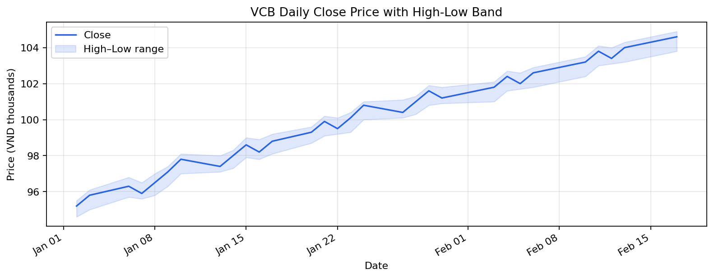
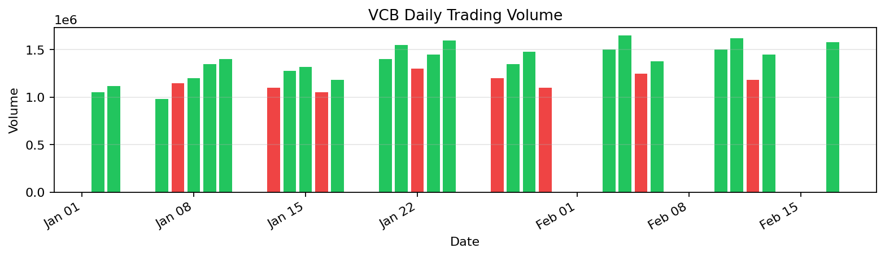

# VCB Stock Analysis

_Generated: 2026-02-21 08:12:17_

## Artifacts

- [vcb_price_band.png](assets/vcb_price_band.png)
- [vcb_volume.png](assets/vcb_volume.png)
- [vcb_prices.csv](assets/vcb_prices.csv)
- [vcb_weekly.csv](assets/vcb_weekly.csv)

---

## Overview

This report analyzes **VCB (Vietcombank)** daily trading data for January–February 2026, covering price trends, volume patterns, and weekly aggregation.

#### Report Parameters

| Key | Value |
| --- | --- |
| Symbol | VCB |
| Exchange | HOSE |
| Period | Jan 2 – Feb 17, 2026 |
| Frequency | Daily |

## Raw Data

#### Price data (first 10 rows)

| date                | symbol   |   close |   volume |   open |   high |   low |
|:--------------------|:---------|--------:|---------:|-------:|-------:|------:|
| 2026-01-02 00:00:00 | VCB      |    95.2 |  1050000 |   94.8 |   95.5 |  94.6 |
| 2026-01-03 00:00:00 | VCB      |    95.8 |  1120000 |   95.3 |   96.1 |  95   |
| 2026-01-06 00:00:00 | VCB      |    96.3 |   980000 |   95.9 |   96.8 |  95.7 |
| 2026-01-07 00:00:00 | VCB      |    95.9 |  1150000 |   96.4 |   96.5 |  95.6 |
| 2026-01-08 00:00:00 | VCB      |    96.5 |  1200000 |   96   |   97   |  95.8 |
| 2026-01-09 00:00:00 | VCB      |    97.1 |  1350000 |   96.6 |   97.4 |  96.3 |
| 2026-01-10 00:00:00 | VCB      |    97.8 |  1400000 |   97.2 |   98.1 |  97   |
| 2026-01-13 00:00:00 | VCB      |    97.4 |  1100000 |   97.9 |   98   |  97.1 |
| 2026-01-14 00:00:00 | VCB      |    98   |  1280000 |   97.5 |   98.3 |  97.3 |
| 2026-01-15 00:00:00 | VCB      |    98.6 |  1320000 |   98.1 |   99   |  97.9 |

_shape: 10 rows × 7 cols_

_Showing 10 of 30 trading days_

## Summary Statistics

#### VCB Trading Data Summary

- **Shape**: 30 rows × 4 cols
- **Columns**: close, volume, high, low

**Numeric stats (top 10):**

|        |        mean |          std |      min |        max |
|:-------|------------:|-------------:|---------:|-----------:|
| close  |  99.9067    |      2.71356 |     95.2 | 104.6      |
| volume |   1.324e+06 | 189529       | 980000   |   1.65e+06 |
| high   | 100.31      |      2.68923 |     95.5 | 104.9      |
| low    |  99.2733    |      2.68443 |     94.6 | 103.8      |

| **Latest Close** | **Total Return** | **Price Range** | **Avg Volume** |
| :---: | :---: | :---: | :---: |
| **104.60** | **+9.9%** | **9.40** | **1,324,000** |
| — | ▲ +9.9% | — | — |

## Weekly Aggregation

#### Weekly price statistics

| week                |   avg_close |   min_close |   max_close |   trading_days |
|:--------------------|------------:|------------:|------------:|---------------:|
| 2026-01-04 00:00:00 |       95.5  |        95.2 |        95.8 |              2 |
| 2026-01-11 00:00:00 |       96.72 |        95.9 |        97.8 |              5 |
| 2026-01-18 00:00:00 |       98.2  |        97.4 |        98.8 |              5 |
| 2026-01-25 00:00:00 |       99.92 |        99.3 |       100.8 |              5 |
| 2026-02-01 00:00:00 |      101.05 |       100.4 |       101.6 |              4 |
| 2026-02-08 00:00:00 |      102.2  |       101.8 |       102.6 |              4 |
| 2026-02-15 00:00:00 |      103.6  |       103.2 |       104   |              4 |
| 2026-02-22 00:00:00 |      104.6  |       104.6 |       104.6 |              1 |

_shape: 8 rows × 5 cols_

#### Aggregation Summary

| Key | Value |
| --- | --- |
| Weeks Covered | 8 |
| Best Week Avg | 104.60 |
| Worst Week Avg | 95.50 |
| Overall Range | 95.20 – 104.60 |

## Price Chart

*VCB daily closing price with high-low range*

## Volume Chart

*Green = close >= open, Red = close < open*

## Data Export

**Exported:** [VCB price data](assets/vcb_prices.csv)

**Exported:** [VCB weekly aggregation](assets/vcb_weekly.csv)

> ✅ **Success:** All data exported for downstream analysis.

## Interpretation

- VCB shows a **steady upward trend** over the sample period, gaining **9.9%**.
- The high-low band remains narrow, indicating **low intraday volatility**.
- Volume increases in the latter half suggest **growing institutional interest**.
- Weekly aggregation confirms consistent upward drift with no significant pullbacks.

### Next Steps

1. Compare against sector peers (TCB, VPB, ACB)
2. Overlay technical indicators (RSI, MACD, Bollinger Bands)
3. Check macro regime alignment for timing signals

