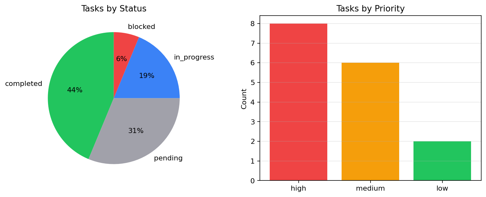
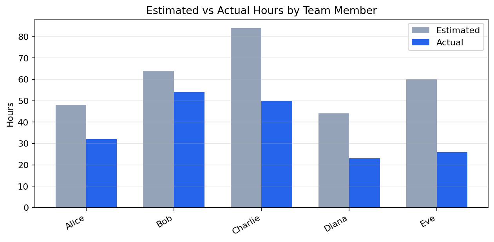

# Project Status Report

_Generated: 2026-02-21 08:12:23_

## Artifacts

- [task_breakdown.png](assets/task_breakdown.png)
- [hours_comparison.png](assets/hours_comparison.png)
- [tasks_full.csv](assets/tasks_full.csv)
- [team_workload.csv](assets/team_workload.csv)

---

## Project Overview

**`ℹ️ Sprint 2`**

**`⚠️ IN PROGRESS`**

| **Total Tasks** | **Completed** | **In Progress** | **Blocked** |
| :---: | :---: | :---: | :---: |
| **16** | **7** | **3** | **1** |
| — | ▲ 44% | — | — |

`[████████░░░░░░░░░░░░] 44%` Overall: 7/16 tasks complete

## Sprint Breakdown

**`✅ Sprint 1`**

`[████████████████████] 100%` Sprint 1: 5/5 complete

#### Sprint 1 Tasks

| task_id   | title                  | assignee   | status    | priority   |
|:----------|:-----------------------|:-----------|:----------|:-----------|
| T-101     | User authentication    | Alice      | completed | high       |
| T-102     | Database schema design | Bob        | completed | high       |
| T-103     | REST API endpoints     | Charlie    | completed | high       |
| T-104     | Unit test framework    | Alice      | completed | medium     |
| T-105     | CI/CD pipeline setup   | Diana      | completed | medium     |

_shape: 5 rows × 5 cols_

**`⚠️ Sprint 2`**

`[████████░░░░░░░░░░░░] 40%` Sprint 2: 2/5 complete

#### Sprint 2 Tasks

| task_id   | title                | assignee   | status      | priority   |
|:----------|:---------------------|:-----------|:------------|:-----------|
| T-201     | Product listing page | Eve        | completed   | high       |
| T-202     | Shopping cart logic  | Bob        | completed   | high       |
| T-203     | Payment integration  | Charlie    | in_progress | high       |
| T-204     | Email notifications  | Alice      | in_progress | medium     |
| T-205     | Search functionality | Diana      | in_progress | medium     |

_shape: 5 rows × 5 cols_

**`Sprint 3`**

`[░░░░░░░░░░░░░░░░░░░░] 0%` Sprint 3: 0/6 complete

#### Sprint 3 Tasks

| task_id   | title                    | assignee   | status   | priority   |
|:----------|:-------------------------|:-----------|:---------|:-----------|
| T-206     | Admin dashboard          | Eve        | pending  | low        |
| T-301     | Performance optimization | Bob        | pending  | high       |
| T-302     | Mobile responsive UI     | Charlie    | pending  | medium     |
| T-303     | Documentation            | Diana      | pending  | low        |
| T-304     | Load testing             | Alice      | pending  | medium     |
| T-305     | Security audit           | Eve        | blocked  | high       |

_shape: 6 rows × 5 cols_

## Status Summary

#### Tasks by Status

| Key | Value |
| --- | --- |
| completed | 7 |
| pending | 5 |
| in_progress | 3 |
| blocked | 1 |

#### Tasks by Priority

| Key | Value |
| --- | --- |
| high | 8 |
| medium | 6 |
| low | 2 |

*Task distribution by status and priority*

## Team Workload

#### Workload by Team Member

| assignee   |   tasks |   completed |   estimated |   actual |   completion |
|:-----------|--------:|------------:|------------:|---------:|-------------:|
| Alice      |       4 |           2 |          48 |       32 |           50 |
| Bob        |       3 |           2 |          64 |       54 |           67 |
| Charlie    |       3 |           1 |          84 |       50 |           33 |
| Diana      |       3 |           1 |          44 |       23 |           33 |
| Eve        |       3 |           1 |          60 |       26 |           33 |

_shape: 5 rows × 6 cols_

<strong>Estimation Accuracy</strong>

> ✅ **Success:** **Alice**: 32h actual vs 48h estimated (67% — under estimate)

> ✅ **Success:** **Bob**: 54h actual vs 64h estimated (84% — under estimate)

> ✅ **Success:** **Charlie**: 50h actual vs 84h estimated (60% — under estimate)

> ✅ **Success:** **Diana**: 23h actual vs 44h estimated (52% — under estimate)

> ✅ **Success:** **Eve**: 26h actual vs 60h estimated (43% — under estimate)

## Hours Tracking

| **Total Estimated** | **Hours Logged** | **Remaining (est)** |
| :---: | :---: | :---: |
| **300h** | **185h** | **96h** |

Hours Burned: **185** (▼ -115, -38.3%)

*Estimated vs actual hours per team member*

## Risks & Blockers

> ❌ **Error:** **BLOCKED** — T-305: Security audit (assigned to Eve)

> ⚠️ **Warning:** 2 high-priority tasks are not yet started or blocked:

#### At-Risk High-Priority Tasks

| task_id   | title                    | assignee   | status   |
|:----------|:-------------------------|:-----------|:---------|
| T-301     | Performance optimization | Bob        | pending  |
| T-305     | Security audit           | Eve        | blocked  |

_shape: 2 rows × 4 cols_

## Data Export

**Exported:** [Full task list](assets/tasks_full.csv)

**Exported:** [Team workload summary](assets/team_workload.csv)

🟢 **Jira**: connected — Project: DEMO-2026

> ✅ **Success:** Status report generation complete.

