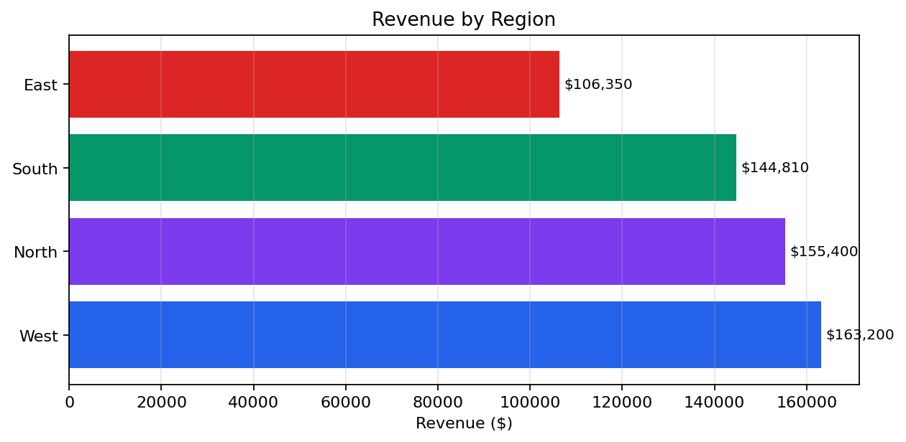
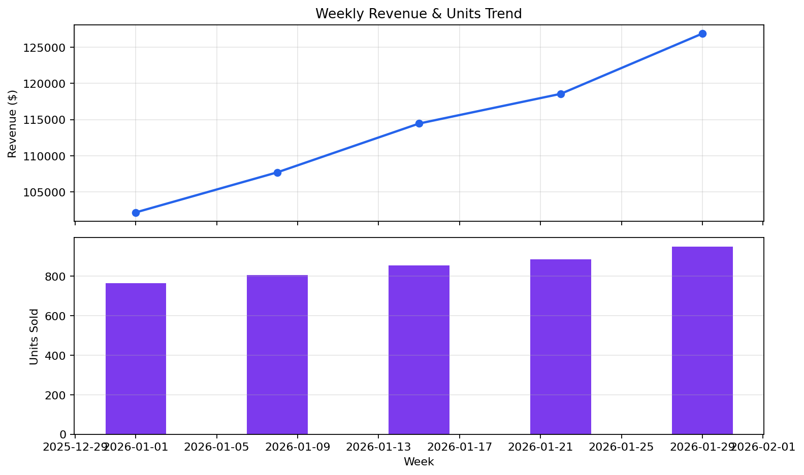

# Sales Dashboard Demo

A KPI-driven sales dashboard built from regional sales data, demonstrating
how notebookmd can generate executive-ready reports.

## What This Demo Shows

- Executive summary with metric cards and badges
- Week-over-week change indicators
- Regional performance rankings
- Product comparison with tabbed views
- Horizontal bar charts for regional breakdown
- Dual-axis weekly trend charts
- Margin analysis with expander insights
- Multi-table CSV export

## Files

```
sales-dashboard/
├── README.md           # This file
├── data/
│   └── sales.csv       # 5 weeks × 4 regions × 2 products
├── run.py              # Dashboard script
└── output/             # Generated report + chart assets
```

## Requirements

```bash
pip install "notebookmd[all]"   # pandas + matplotlib
```

## Run

```bash
cd examples/sales-dashboard
python run.py
```

## Sample Output

Generates `output/notebook.md` with KPI cards, ranking tables, trend charts,
and exported CSVs in `output/assets/`.

---

<!-- BEGIN SAMPLE OUTPUT -->

# Sales Dashboard — January 2026

_Generated: 2026-02-21_

## Artifacts

- [revenue_by_region.png](assets/revenue_by_region.png)
- [weekly_trends.png](assets/weekly_trends.png)
- [sales_full.csv](assets/sales_full.csv)
- [region_summary.csv](assets/region_summary.csv)
- [weekly_trends.csv](assets/weekly_trends.csv)


---

## Executive Summary

**`✅ LIVE`**

Monthly performance overview for all regions and products.

| **Total Revenue** | **Total Profit** | **Units Sold** | **Avg Margin** |
| :---: | :---: | :---: | :---: |
| **$569,760** | **$232,550** | **4,263** | **40.8%** |

Weekly Revenue: **126,900** (▲ +24,750, +24.2%)

## Regional Performance

#### Revenue by Region

| region   |   revenue |   profit |   units |   margin |
|:---------|----------:|---------:|--------:|---------:|
| West     |    163200 |    66730 |    1233 |     40.9 |
| North    |    155400 |    63520 |    1172 |     40.9 |
| South    |    144810 |    58900 |    1063 |     40.7 |
| East     |    106350 |    43400 |     795 |     40.8 |

_shape: 4 rows × 5 cols_

West: **163,200** (#1 of 4)

North: **155,400** (#2 of 4)

South: **144,810** (#3 of 4)

East: **106,350** (#4 of 4)



*Regional revenue comparison*

## Product Analysis

[**Widget A** | **Widget B** | **Comparison**]

#### Widget A

| **Revenue** | **Units** | **Avg Margin** |
| :---: | :---: | :---: |
| **$278,760** | **2,323** | **41.7%** |

---

#### Widget B

| **Revenue** | **Units** | **Avg Margin** |
| :---: | :---: | :---: |
| **$291,000** | **1,940** | **40.0%** |

---

#### Comparison

#### Product Comparison

| product   |   revenue |   units |   profit |   margin |
|:----------|----------:|--------:|---------:|---------:|
| Widget A  |    278760 |    2323 |   116150 |     41.7 |
| Widget B  |    291000 |    1940 |   116400 |     40   |

_shape: 2 rows × 5 cols_

---

## Weekly Trends

#### Weekly totals

| date                |   revenue |   units |   profit |
|:--------------------|----------:|--------:|---------:|
| 2026-01-01 00:00:00 |    102150 |     765 |    41700 |
| 2026-01-08 00:00:00 |    107700 |     807 |    43970 |
| 2026-01-15 00:00:00 |    114450 |     856 |    46710 |
| 2026-01-22 00:00:00 |    118560 |     886 |    48380 |
| 2026-01-29 00:00:00 |    126900 |     949 |    51790 |

_shape: 5 rows × 4 cols_



*Revenue and unit trends over 5 weeks*

## Margin Analysis

#### Margin by Region × Product

| region   | product   |   revenue |   profit |   margin |
|:---------|:----------|----------:|---------:|---------:|
| East     | Widget A  |     51600 |    21500 |     41.7 |
| East     | Widget B  |     54750 |    21900 |     40   |
| North    | Widget A  |     81600 |    34000 |     41.7 |
| North    | Widget B  |     73800 |    29520 |     40   |
| South    | Widget A  |     58560 |    24400 |     41.7 |
| South    | Widget B  |     86250 |    34500 |     40   |
| West     | Widget A  |     87000 |    36250 |     41.7 |
| West     | Widget B  |     76200 |    30480 |     40   |

_shape: 8 rows × 5 cols_

<details open>
<summary><strong>Margin Insights</strong></summary>

> ✅ **Success:** Highest margin: **East / Widget A** at 41.7%

> ⚠️ **Warning:** Lowest margin: **East / Widget B** at 40.0%

</details>

## Data Export

**Exported:** [Full sales data](assets/sales_full.csv)

**Exported:** [Regional summary](assets/region_summary.csv)

**Exported:** [Weekly trends](assets/weekly_trends.csv)

> ✅ **Success:** Dashboard generation complete.

<!-- END SAMPLE OUTPUT -->
