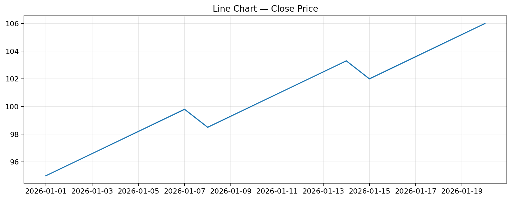
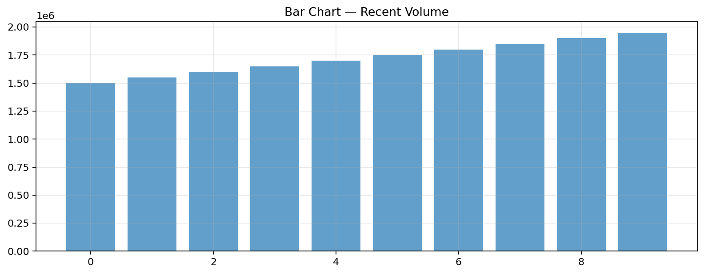
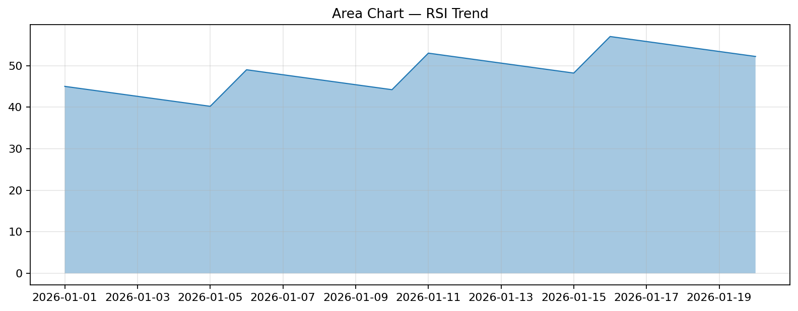

A comprehensive tour of every widget available in `notebookmd`.

# Widget Showcase

_Generated: 2026-02-21 11:40:50_

## Artifacts

- [line_1.png](assets/line_1.png)
- [bar_2.png](assets/bar_2.png)
- [area_3.png](assets/area_3.png)
- [sample_data.csv](assets/sample_data.csv)


---

## Text Elements

# Dashboard Title

## Section Header

---

### Subsection Header

_This is a small caption — useful for footnotes and attributions._

```text
Fixed-width preformatted text block
  preserves spacing and indentation
```

$$
\bar{x} = \frac{1}{n} \sum_{i=1}^{n} x_i
$$

---

Regular **markdown** with `inline code` and [links](https://example.com).

## Code Display

```python
import notebookmd
n = notebookmd.nb("report.md")
n.metric("Users", 42)
```

### Echo (Code + Output)

```python
df = fetch_quote("AAPL", start="2025-01-01")
print(f"Rows: {len(df)}")
```

```text
Rows: 280
```

## Metric Cards

| **Total Revenue** |
| :---: |
| **$1,234,567** |
| +12.3% |

| **Active Users** |
| :---: |
| **34,521** |
| +2,100 |

| **Churn Rate** |
| :---: |
| **2.1%** |
| -0.3% |

### Metric Row

| **Revenue** | **Profit** | **Users** | **Churn** |
| :---: | :---: | :---: | :---: |
| **$1.2M** | **$340K** | **3,400** | **2.1%** |
| ▲ +12% | ▲ +8% | ▲ +200 | ▲ -0.3% |

## Analytics Helpers

### Stat & Stats

Total Orders: **12450** (Last 30 days)

Revenue: **$1.2M** · Orders: **12,450** · AOV: **$96.40**

### Badges

**`✅ LIVE`**

**`⚠️ BETA`**

**`❌ DEPRECATED`**

**`ℹ️ v2.1.0`**

**`internal`**

### Change Indicator

Monthly Revenue: **1,240,000** (▲ +135,000, +12.2%)

### Ranking

AAPL: **267.40** (96th percentile, top 4%, #1 of 30)

## JSON Display

```json
{
  "symbol": "AAPL",
  "exchange": "NASDAQ",
  "metrics": {
    "pe_ratio": 32.5,
    "pb_ratio": 48.1,
    "dividend_yield": 0.005
  },
  "tags": [
    "mega-cap",
    "tech",
    "dividend"
  ]
}
```

```json
{"compact": true, "value": 42}
```

## Status Elements

> ✅ **Success:** Data loaded successfully! 1,234 rows processed.

> ℹ️ **Info:** Processing will use cached data from the last 24 hours.

> ⚠️ **Warning:** Missing data detected for 3 trading days.

> ❌ **Error:** Failed to fetch real-time quotes. Using last known prices.

### Progress Bars

`[█████░░░░░░░░░░░░░░░] 25%` Downloading data...

`[██████████░░░░░░░░░░] 50%` Processing...

`[███████████████░░░░░] 75%` Generating charts...

`[████████████████████] 100%` Complete!

### Toast & Connection

> 🔔 New data available for AAPL

🟢 **Yahoo Finance API**: connected — v2.0

🔴 **Redis cache**: disconnected — timeout after 5s

## Expanders (Collapsible Sections)

<details open>
<summary><strong>Methodology</strong></summary>

The analysis uses a multi-factor model combining:
- **Value**: P/E, P/B ratios relative to sector median
- **Momentum**: 6-month and 12-month price returns
- **Quality**: ROE, debt-to-equity, earnings stability


</details>

<details>
<summary><strong>Data Sources</strong></summary>

- NASDAQ market data via Yahoo Finance API
- Financial statements from SEC filings
- Macro indicators from FRED/BLS


</details>

## Tabs

[**Overview** | **Technical** | **Fundamental**]

#### Overview

| **Price** | **Change** | **Volume** |
| :---: | :---: | :---: |
| **95,400** | **+1.2%** | **1.5M** |
| — | ▲ +1.2% | — |

---

#### Technical

#### Technical Indicators

| Key | Value |
| --- | --- |
| RSI (14) | 62.3 |
| MACD | Bullish crossover |
| EMA 20 | 94,200 |
| Support | 93,000 |
| Resistance | 97,500 |

---

#### Fundamental

#### Fundamental Metrics

| Key | Value |
| --- | --- |
| P/E | 32.5x |
| P/B | 48.1x |
| ROE | 157% |
| Dividend Yield | 0.5% |
| Gross Margin | 46.2% |

---

## Columns & Containers

<!-- columns: 3 -->

| **Revenue** |
| :---: |
| **$1.2M** |
| +12% |

| | |
| **Profit** |
| :---: |
| **$340K** |
| +8% |

| | |
| **Users** |
| :---: |
| **3,400** |
| ▲ +200 |

<!-- /columns -->

> ---
>
This content is inside a **bordered container**.

#### Metrics

| Key | Value |
| --- | --- |
| Status | Active |
| Last Updated | 2026-02-21 |

>
> ---

## DataFrame Display

#### Sample Trading Data

| date                | close   | volume   | rsi   |
|:--------------------|:--------|:---------|:------|
| 2026-01-01 00:00:00 | 95.0    | 1000000  | 45.0  |
| 2026-01-02 00:00:00 | 95.8    | 1050000  | 43.8  |
| 2026-01-03 00:00:00 | 96.6    | 1100000  | 42.6  |
| 2026-01-04 00:00:00 | 97.4    | 1150000  | 41.4  |
| 2026-01-05 00:00:00 | 98.2    | 1200000  | 40.2  |
| 2026-01-06 00:00:00 | 99.0    | 1250000  | 49.0  |
| 2026-01-07 00:00:00 | 99.8    | 1300000  | 47.8  |
| 2026-01-08 00:00:00 | 98.5    | 1350000  | 46.6  |
| 2026-01-09 00:00:00 | 99.3    | 1400000  | 45.4  |
| 2026-01-10 00:00:00 | 100.1   | 1450000  | 44.2  |
| 2026-01-11 00:00:00 | 100.9   | 1500000  | 53.0  |
| 2026-01-12 00:00:00 | 101.7   | 1550000  | 51.8  |
| 2026-01-13 00:00:00 | 102.5   | 1600000  | 50.6  |
| 2026-01-14 00:00:00 | 103.3   | 1650000  | 49.4  |
| 2026-01-15 00:00:00 | 102.0   | 1700000  | 48.2  |
| …                   | …       | …        | …     |

_shape: 20 rows × 4 cols_

#### Data Summary

- **Shape**: 20 rows × 4 cols
- **Columns**: date, close, volume, rsi

**Numeric stats (top 10):**

|        |        mean |          std |    min |        max |
|:-------|------------:|-------------:|-------:|-----------:|
| close  | 100.605     |      3.15152 | 95     | 106        |
| volume |   1.475e+06 | 295804       |  1e+06 |   1.95e+06 |
| rsi    |  48.6       |      4.90757 | 40.2   |  57        |

## Key-Value Display

#### Company Profile

| Key | Value |
| --- | --- |
| Symbol | AAPL |
| Sector | Technology |
| Market Cap | $3.4T |
| Float | 99.6% |
| Dividend Yield | 0.5% |

## Built-in Charts



*Line Chart — Close Price*



*Bar Chart — Recent Volume*



*Area Chart — RSI Trend*

## Export

**Exported:** [Sample trading data](assets/sample_data.csv)

## Celebration

> ✅ **Success:** Widget showcase complete!

> 🎈🎈🎈 **Celebration!**

> ❄️❄️❄️ **Snow!**

